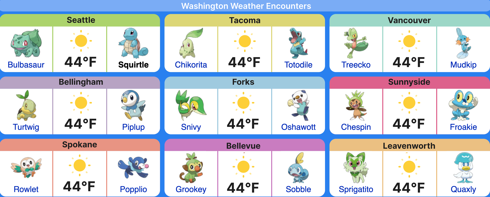

# Pokémon Weather Encounter
By: Angel Torres & Michelle Nguyen

## **Project Proposal:**
As lifelong fans of Pokémon, we grew up captivated by the idea of a world where Pokémon were real, something we wish we could encounter in our day-to-day lives. With that in mind, we propose to design a project that enables a portion of that dream to come to life by combining Pokémon with the daily task of checking the weather. By matching local weather conditions with Pokémon habitats, this project transforms a routine task into an interactive, entertaining experience, offering a glimpse of which Pokémon might appear in the wild based on real-world weather.

This tool is intended for Pokémon fans of all ages who want to feel a closer connection to the Pokémon world in their everyday lives. It also adds a spark of enjoyment for anyone looking for a new and engaging way to get their weather updates. Ultimately, this project transforms weather checking into an interactive experience, fostering a sense of connection between the digital and real world for Pokémon fans.

Overall, we want to build a website that uses real-time weather and geolocation data of nine cities throughout Washington state, including: Seattle, Bellevue, Tacoma, Vancouver, Bellingham, Forks, Sunnyside, Leavenworth, and Spokane.

## Intended Output:

